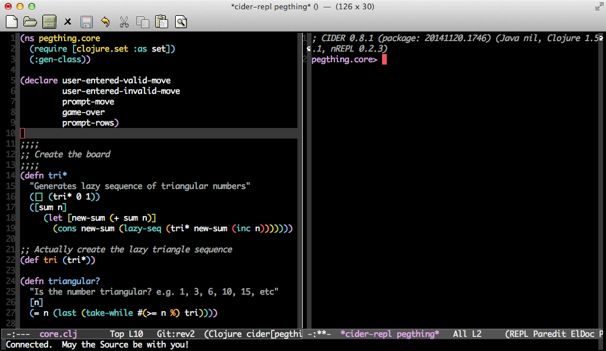
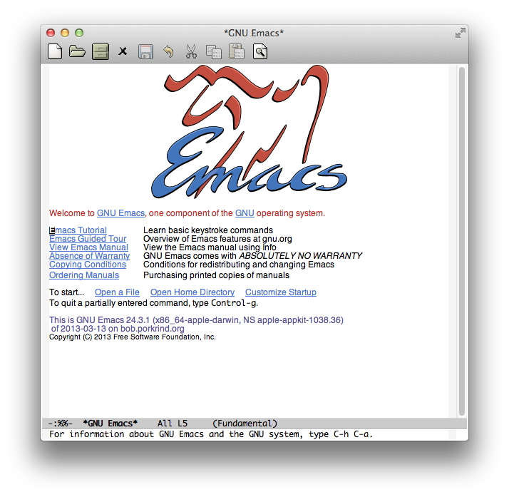
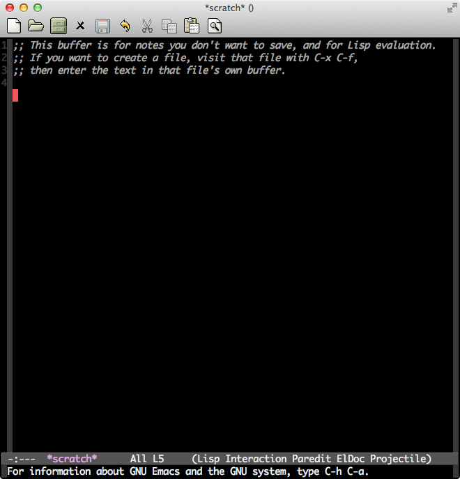
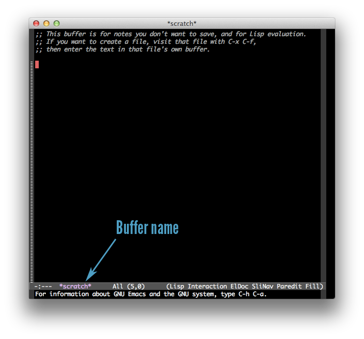
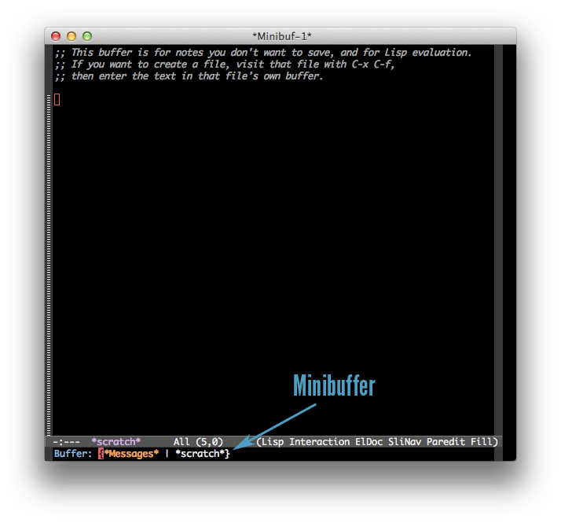

### *Capítulo 2: Como usar o Emacs, um ótimo editor de código para Clojure*
Na sua jornada para se tornar um mestre do Clojure, o seu editor será o seu aliado mais próximo. Eu recomendo fortemente trabalhar com o Emacs, mas você pode, claro, usar qualquer editor que preferir. Se você não seguir as instruções detalhadas sobre o Emacs neste capitulo, ou se você escolher usar um editor diferente, vale a pena ao menos investir algum tempo configurando o seu editor para trabalhar com um REPL. Duas alternativas que eu recomendo e que são bem avaliadas na comunidade são [Cursive](https://cursive-ide.com/) e [NightCode](https://github.com/oakes/Nightcode).

O motivo da minha recomendação do Emacs é que ele oferece uma boa integração com o REPL do Clojure, o qual te permite rodar o seu código instantaneamente enquanto você o escreve. Essa possibilidade de feedback rápido vai ser útil enquanto você estiver aprendendo clojure e depois quando estiver escrevendo programas Clojure de verdade. O Emacs também é ótimo para trabalhar com qualquer dialeto Lisp, na verdade, o Emacs é escrito num dialeto Lisp chamado Emacs Lisp. (elisp). 

Ao final deste capítulo as suas configurações do Emacs vão estar mais ou menos assim:

*Imagem 2-1: Uma típica configuração do Emacs com o código Clojure de um lado e o REPL do outro*

Para chegar lá, você vai começar instalando o Emacs e adicionar uma configuração amigável para pessoas iniciantes. Então, você irá aprender o básico: Como abrir, editar, salvar arquivos e como interagir com o Emacs usando atalhos do teclado essenciais. Por último você irá aprender como de fato editar um código Clojure e interagir com o REPL.

## Instalando o Emacs
Você deverá usar a última versão major do Emacs, Emacs 24, para a plataforma que você estiver utilizando: 
- **OS X** Instale o Emacs padrão como aplicativo do Mac da página no [Emacs para Mac OS X](https://emacsformacosx.com/). Outras opções como Aquamacs deveriam deixar o Emacs com uma carinha de Mac, mas ao longo prazo eles são problemáticos, porque as configurações são tão diferentes do Emacs padrão que fica difficile seguir o manual ou tutoriais do Emacs.
- **Ubuntu** Siga as instruções de instalação do [Emacs no Ubuntu](https://www.gnu.org/software/emacs/download.html#ubuntu). (confirmar se o link está correto????)
- **Windows** Você encontra o arquivo binário em [Emacs para Windows](https://ftp.gnu.org/gnu/emacs/windows/). Após baixar o arquivo, e descompactar a última versão você pode rodar o executable do Emacs que está na pasta `bin\runemacs.exe`.

Após instalar o Emacs, abra o aplicativo e veja se tudo está funcionando. Você deve ver uma tela inicial como a imagem abaixo:

*Imagem 2-2: A tela inicial do Emacs*

Seja bem vindo ao culto do Emacs! Você deixou o Richard Stallman orgulhoso!

## Configurações

Eu criei um repositorio com todos os arquivos que você precisa para configurar o Emcas para clojure que está disponível em [https://github.com/flyingmachine/emacs-for-clojure/archive/book1.zip](https://github.com/flyingmachine/emacs-for-clojure/archive/book1.zip)

Observação: Essas ferramentas sao constamente atualizadas.Entao se as instruções abaixo nao funcionarem para voce ou se voce quiser utilizar a ultima instrução, por favor leia a instrução em
[https://github.com/flyingmachine/emacs-for-clojure/.](https://github.com/flyingmachine/emacs-for-clojure/.)

Faça o seguinte para deletar a configuração existente do seu Emacs e instale a a configuração amigavel ao Clojure. 

1. Feche o Emacs
2. Delete o arquivo *~/.emacs OU ~/.emacs.d* se eles existirem (usuários de Windows, seu arquivo de Emcs está em *C:\Users\your_user_name\AppData\Roaming*.) Este é o local onde ficam os arquivos de configuração do Emcas e deletando estes arquivos e diretorios voce tera certeza de estará iniciando com uma folha em branco.
3. Baixe o arquivo de configuração citado no item 1 e descompacte-o. No conteúdo deverá ter uma pasta *emacs-for-clojure-book1* . Execute o comando *mv path/to/emacs-for-clojure-book1 ~/.emacs.d.*
4. Abra o Emacs.
Quando voce abrir o Emacs, você verá muita atividades, pois ele estára baixando um monte de pacotes úteis. Quando esta atividades terminarem, feche e abra o Emacs novamente. (Se não tiver nenhuma atividade rolando, não tem problema, feche e abra o Emacs por diversão mesmo.) Apos ter feito isso você deverá ver uma janela como na Imagem 2-3, abaixo. 

Agora que já temos tudo configurado. Vamos aprendar como usar o Emacs!

## (?) Escotilha de Fuga do Emacs

Antes de nos aprofundarmos nas coisas divertidas, voce precisa saber de um comando importante do Emacs: *ctrl-g*. Este comando irá encerrar qualquer comando que você estiver tentando executar. Então, se as coisas não estiverem correndo bem, se acalme e pressione *ctrl* e *g* juntos e tente de novo. Isso nao fechára o Emacs e nem fará voce perder nenhum trabalho; Isso irá apenas cancelar a ação que estiver sendo executada na hora.

## Buffer do Emacs 

Toda edição acontece em um buffer do Emacs, logo que você iniciar, um buffer chamado *scratch* é aberto. O Emacs sempre mostra o nome do buffer atual na parte inferior da janela, como mostra a imagem 2-4:

Por padrão o buffer *scratch* gerencia parenteses e identação da forma mais otimizada para desenvolvimento Lisp, mas pode ser incoveniente para escrever textos simples. Vamos criar um buffer fresquinho para que possamos brincar um pouco sem que nada inesperado aconteça. Para criar um buffer, fação isso:

1. Pressione *ctrl* e aperte *X*
2. Solte o *ctrl*
3. Pressione *B*

Podemos expressar essa mesma sequencia de uma forma mais compacta **C-x b**.

Apos executar essa sequence de teclas, voce verá um prompt na parte inferior desta aplicação como na image 2-5.

*Imagem 2-5: O minibuffer é onde o Emacs fornece um prompt para a entrada de dados.

