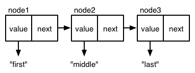

### *Capítulo 4: Funções principais em profundidade*

Se assim como eu você é fã de carteirinha do _The Vampire Diaries_, uma série juvenil e cheia de drama dignos de novela mexicana, você vai se lembrar do episódio em que a protagonista, Elena, começa a questionar o comportamento do seu misterioso e pálido crush: "Por que ele sumiu instantaneamente sem deixar rastro quando ralei o joelho?" e ​​"Como é que o rosto dele se transformou numa máscara grotesca da morte quando cortei o dedo?", e por aí vai.

Você pode estar se fazendo perguntas semelhantes se começou a usar as funções principais do Clojure. "Por que o `map` retornou uma lista quando eu passei um vetor?" e "Por que o `reduce` trata meu `map` como uma lista de vetores?". E  assim por diante. (A parte boa é que com o Clojure, você pelo menos se livra de contemplar o profundo horror existencial de ser um adolescente de 17 anos para toda a eternidade.)

Neste capítulo, você aprenderá sobre o conceito obscuro, sanguinário, supernatur... _**cof, cof**_ , digo, neste capítulo, você aprenderá sobre o conceito fundamental do Clojure de programação para abstrações e sobre as abstrações de _sequence_ e _collection_. Você também aprenderá sobre _lazy sequences_. Isso lhe dará a base necessária para ler a documentação de funções que você nunca usou antes e para entender o que acontece quando você for tentar utilizá-las.

Em seguida, você irá: ganhar mais experiência com as funções mais usadas. Aprender a trabalhar com listas, vetores, mapas e conjuntos usando as funções `map`, `reduce`, `into`, `conj`, `concat`, `some`, `filter`, `take`, `drop`, `sort`, `sort-by` e `identity`. Também vai aprender a criar novas funções com `apply`, `partial` e `complement`. Todas essas informações te ajudarão a entender como fazer as coisas à maneira Clojure e lhe darão uma base sólida para escrever seu próprio código, bem como para ler e aprender com projetos de outras pessoas.

Por último, você irá aprender a _parsear_ e consultar um arquivo CSV com dados de vampiros para determinar quais nosferatu estão na espreita em sua cidade.


## Programando para Abstrações


Para entender a programação para abstrações, vamos comparar o Clojure a uma linguagem que não foi construída com esse princípio em mente: Emacs Lisp (elisp). No elisp você pode usar a função `mapcar` para criar uma nova lista, que é parecido como você usa `map` no Clojure. Porém, se você quiser usar 'map' em um hash map (uma estrutura de dados parecida com o `map` do Clojure) no elisp, você vai precisar usar a função `hashmap`, enquanto que em Clojure você ainda simplesmente usaria `map`. Em outras palavras, elisp usa duas funções diferentes, específicas para cada estrutura de dados, para implementar a operação `map`, mas o Clojure só usa uma. você também pode chamar `reduce` em um mapa no Clojure, entanto o elisp não tem uma função para reduzir um hashmap 

O motivo é que o Clojure define as funções `map`e `reduce` em termos de abstração de _sequences_, não em termos específicos de cada estrutura de dados. Desde que as estruturas de dados respondam às principais operações de _sequence_ (as funções `first`, `rest` e `cons`, que analisaremos mais detalhadamente em breve) ela funcionará com `map`, `reduce` e inúmeras outras funções de _sequence_ sem problemas. É isso que os programadores Clojure entendem por programação para abstrações, e é um princípio fundamental da filosofia Clojure.

Eu penso em abstrações como coleções nomeadas de operações. Se você puder executar todas as operações de uma abstração em um objeto, então esse objeto é uma instância da abstração. Penso dessa forma mesmo fora da programação. Por exemplo, a abstração de bateria inclui a operação "conectar um meio condutor ao seu ânodo e cátodo", e a saída dessa operação é corrente elétrica. Não importa se a bateria é feita de lítio ou de batatas. É uma bateria desde que responda ao conjunto de operações que definem uma bateria.

Do mesmo modo, `map` não se importa como listas, vetores, conjuntos e mapas são implementados. Ela apenas se importa se pode performar operações em _sequences_ nelas. Vamos ver como `map`é definida, em termos de abstração de _sequences_ para que você possa entender a programação para abstrações de modo geral.

## Tratando Listas, Vetores, Conjuntos e Mapas como _Sequences_

Se você pensar na operação de `map` independentemente de qualquer linguagem de programação, ou mesmo da programação em si, seu comportamento essencial é criar uma nova _sequence_ _y_ a partir de uma _sequence_ existente _x_, usando uma função _ƒ_ tal que _y1 = ƒ(x1), y2 = ƒ(x2), ..., yn = ƒ(xn)_. A Imagem 4-1 ilustra como você pode visualizar um mapeamento aplicado a uma _sequence_.


Imagem 4-1: Visualizando um mapeamento
 
(1 - sequence
2 - mapeamento
3 - aplicação individual da função
4 - resultado)

O termo _sequence_ aqui se refere a uma _collection_ de elementos organizados em ordem linear, em oposição a, digamos, uma _collection_ não ordenada ou um grafo sem relação de precedência entre seus nós. A Imagem 4-2 mostra como você pode visualizar uma _sequence_, em contraste com as outras duas _collections_ mencionadas.


Imagem 4-2: Collections sequenciais e não-sequenciais

(1 - sequence / elemento da sequence
2 - collection desordenada
3 - grafo sem relacionamentos antes/depois)


Está ausente desta descrição de mapeamento e _sequences_, qualquer menção a listas, vetores ou outras estruturas de dados concretas. O Clojure foi projetado para nos permitir pensar e programar em termos abstratos o máximo possível, e faz isso implementando funções em termos de abstrações de estruturas de dados. Neste caso, `map` é definido em termos da abstração de uma _sequence_. Em uma conversa, você diria que `map`, `reduce` e outras funções de sequência recebem uma sequência ou até mesmo uma `seq`. De fato, Clojuristas geralmente usam o termo _seq_ em vez de _sequence_, usando termos como funções `seq` e a biblioteca `seq` para se referir a funções que realizam operações sequenciais. Seja usando `sequence` ou `seq`, você está indicando que a estrutura de dados em questão será tratada como uma sequência e que o que está guardado no fundo do seu coração, não importa neste contexto.


Se as funções principais de sequência `first`, `rest` e `cons` funcionam em uma estrutura de dados, você pode dizer que a estrutura de dados implementa a abstração de sequência. Listas, vetores, conjuntos e mapas, todos implementam a abstração de sequência, então todos eles trabalham com `map`, como podemos ver aqui:

``` clojure
(defn titulador
  [topico]
  (str topico " para os Brabo e de Rocha"))

(map titulador ["Hamsters" "Ragnarok"])
; => ("Hamsters para os Brabo e de Rocha" "Ragnarok para os Brabo e de Rocha")

(map titulador '("Empatia" "Decoração"))
; => ("Empatia para os Brabo e de Rocha" "Decoração para os Brabo e de Rocha")

(map titulador #{"Cotovelos" "Escultura em sabonete"})
; => ("Cotovelos para os Brabo e de Rocha" "Escultura em sabonte para os Brabo e de Rocha")

(map #(titulador (second %)) {:algo-desconfortavel "Piscando"})
; => ("Piscando para os Brabo e de Rocha")

```

Os dois primeiros exemplos mostram que `map` funciona de forma idêntica com vetores e listas. O terceiro exemplo mostra que `map` pode funcionar com conjuntos desordenados. No quarto exemplo você precisa chamar a função `second` no argumento da função anônima antes de "titularizar", porque o argumento é um mapa. Irei explicar o porquê em breve, mas primeiro vamos ver as três funções que definem a abstração de sequência.

### first, rest, and cons

Nesta seção, iremos fazer um rápido desvio para o JavaScript para implementar uma lista ligada e três funções principais: `first`, `rest` e `cons`. Depois que essas três funções estiverem implementadas, irei mostrar como você constrói `map` com elas.


O objetivo aqui é avaliar a distinção entre a abstração seq em Clojure e a implementação concreta de uma lista ligada. Não interessa como uma estrutura de dados específica é implementada: quando se trata de usar funções seq numa estrutura de dados, tudo que o Clojure pergunta é: "Posso usar `first`, `rest` e `cons` nisso?". Se a resposta for sim, você pode usar a biblioteca de seq com aquela estrutura de dados.

Em uma lista ligada, os nós são ligados numa sequência linear. Aqui está como você poderia criar uma em JavaScript. Nesse trecho de código, `next` é nulo, porque esse é o último nó da lista:

``` javascript
var node3 = {
  value: "ultimo",
  next: null
};
```

Neste trecho de código, o próximo elemento do `node2` aponta para o `node3`, e o próximo elemento do `node1` aponta para o `node2`; essa é a "ligação" em "lista ligada":

``` javascript
var node2 = {
  value: "meio",
  next: node3
};

var node1 = {
  value: "primeiro",
  next: node2
};
```

Graficamente, você pode representar essa lista como apresentado abaixo na Figura 4-3.



Figura 4-3: Uma lista ligada

Você pode executar três funções principais em uma lista ligada: `first`, `rest` e `cons`. `first` retorna o valor do nó solicitado, `rest` retorna os valores restantes após o nó solicitado e `cons` adiciona um novo nó com o valor fornecido ao início da lista. Depois de implementar essas funções, você pode implementar funções como `map`, `reduce`, `filter` e outras funções sequenciais.

O código a seguir mostra como implementar e usar `first`, `rest` e `cons` com nosso exemplo de nó em JavaScript, bem como como usá-las para retornar nós específicos e derivar uma nova lista. Perceba que o parâmetro de `first` e `rest` se chama _node_. Isso pode ser confuso, pois você pode dizer: "Uai, eu num tô pegando o primeiro elemento de uma lista?". Bem, você opera nos elementos de uma lista um nó de cada vez!

``` javascript
var first = function(node) {
  return node.value;
};

var rest = function(node) {
  return node.next;
};

var cons = function(newValue, node) {
  return {
    value: newValue,
    next: node
  };
};

first(node1);
// => "primeiro"

first(rest(node1));
// => "meio"

first(rest(rest(node1)));
// => "último"

var node0 = cons("novo primeiro", node1);
first(node0);
// => "novo primeiro"

first(rest(node0));
// => "primeiro"
```
